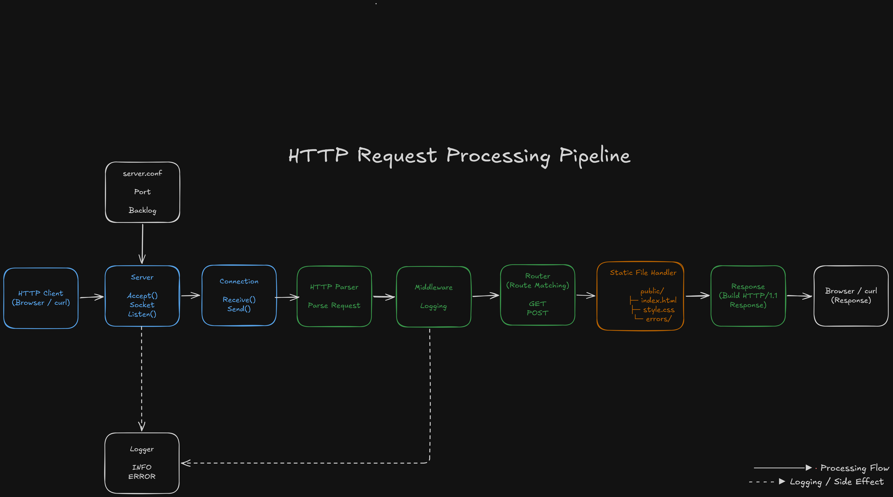
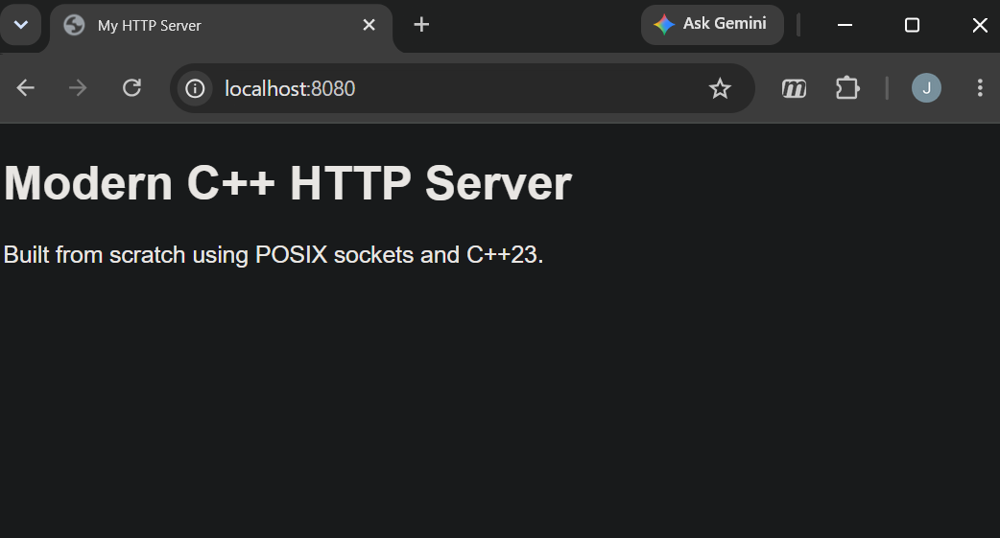
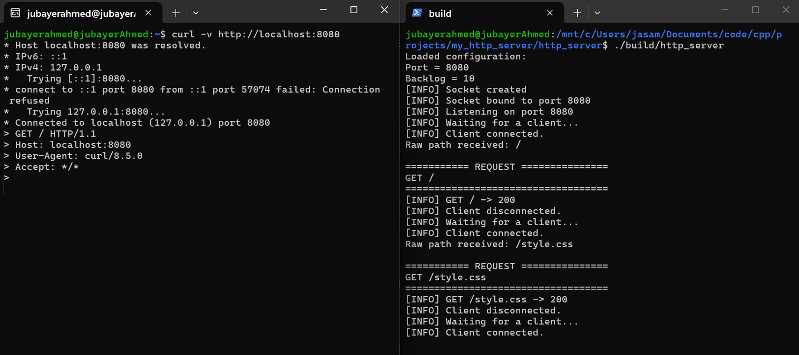
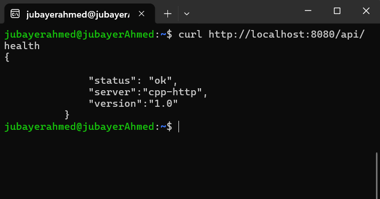

# HTTP Server
   
A modular HTTP/1.1 web server written in **Modern C++23** from scratch using the POSIX Socket API.

This project was built to understand how web servers work internally—from creating TCP sockets and parsing HTTP requests to routing, serving static files, handling errors, and generating HTTP responses.

The goal of this project is educational: to build the core components of a real HTTP server without relying on external web frameworks.

---


## Architecture

<p align="center">
  
</p>

---


## Homepage

<p align="left">
  
</p>

---

<table>
<tr>
<td width="55%">

### Server Logs



</td>

<td width="50%">

### API Response



</td>
</tr>
</table>


Example request

```bash
curl http://localhost:8080/
```

Response

```http
HTTP/1.1 200 OK
Content-Type: text/html
Connection: close
```

---

# Features

## HTTP

- HTTP/1.1 request parsing
- GET support
- POST support
- Query parameter parsing
- HTTP response generation
- Proper status codes
- Content-Length calculation
- Content-Type header support

---

## Routing

- Dynamic route dispatch
- Handler-based routing
- API endpoints

Available routes

| Route | Description |
|--------|-------------|
| `/` | Home page |
| `/health` | Health endpoint |
| `/api/health` | JSON health endpoint |
| Static files | Served from `public/` |

---

## Static File Server

- Serves HTML
- Serves CSS
- MIME type detection
- Directory traversal protection
- Automatic index.html loading

Example

```
/
→ public/index.html
```

---

## Error Handling

Custom responses for

- 400 Bad Request
- 403 Forbidden
- 404 Not Found
- 405 Method Not Allowed
- 500 Internal Server Error

Includes custom HTML error pages.

---

## Logging

- Centralized logger
- Request logging middleware
- Connection lifecycle logging
- Error logging

Example

```
[INFO] Client connected
[INFO] GET / -> 200
[INFO] Client disconnected
```

---

## Configuration

Server configuration is loaded from

```
server.conf
```

Example

```
port=8080
backlog=10
```

---

# Project Structure

```
.
├── include/
│   ├── config/
│   ├── filesystem/
│   ├── http/
│   ├── logger/
│   ├── router/
│   └── server/
│
├── src/
│   ├── config/
│   ├── filesystem/
│   ├── http/
│   ├── logger/
│   ├── router/
│   └── server/
│
├── public/
│   ├── index.html
│   ├── style.css
│   └── errors/
│
├── docs/
├── CMakeLists.txt
└── server.conf
```

---

# Architecture

```
                Client
                   │
                   ▼
             TCP Connection
                   │
                   ▼
               Connection
                   │
                   ▼
             HTTP Parser
                   │
                   ▼
             Middleware
                   │
                   ▼
               Router
          ┌────────┴────────┐
          │                 │
          ▼                 ▼
 API Handlers      Static File Handler
          │                 │
          └────────┬────────┘
                   ▼
              HTTP Response
                   │
                   ▼
                 Client
```

---

# Build

Requirements

- Linux
- CMake
- C++23 compiler

Clone

```bash
git clone https://github.com/JubayerAhmedSamrat/http_server.git
cd http_server
```

Build

```bash
cmake -S . -B build
cmake --build build
```

Run

```bash
./build/http_server
```

---

# Design Goals

This project emphasizes

- Clean architecture
- Separation of concerns
- RAII
- Modern C++
- Modular design
- Maintainability
- Systems programming fundamentals

Each subsystem is implemented independently and communicates through well-defined interfaces.

---

# Concepts Practiced

- POSIX Sockets
- TCP Networking
- HTTP/1.1
- Request Parsing
- Response Serialization
- Static File Serving
- MIME Types
- Configuration Parsing
- Middleware
- Routing
- Error Handling
- Resource Management
- Modern C++23

---

# Future Work

Version 2 will introduce production-oriented features such as

- Thread Pool
- Multithreaded request handling
- Persistent Connections
- Keep-Alive
- epoll
- Non-blocking sockets
- Connection timeout
- Reverse Proxy
- Load Balancer
- HTTPS/TLS
- HTTP/2

---

# Why I Built This

Most web developers use frameworks that abstract away networking details.

This project was built to understand what happens underneath frameworks by implementing a web server from scratch using only the C++ standard library and POSIX system calls.

The long-term goal is to build increasingly sophisticated backend infrastructure, including multithreaded servers, reverse proxies, distributed systems, and AI inference infrastructure.

---

# License

MIT License
